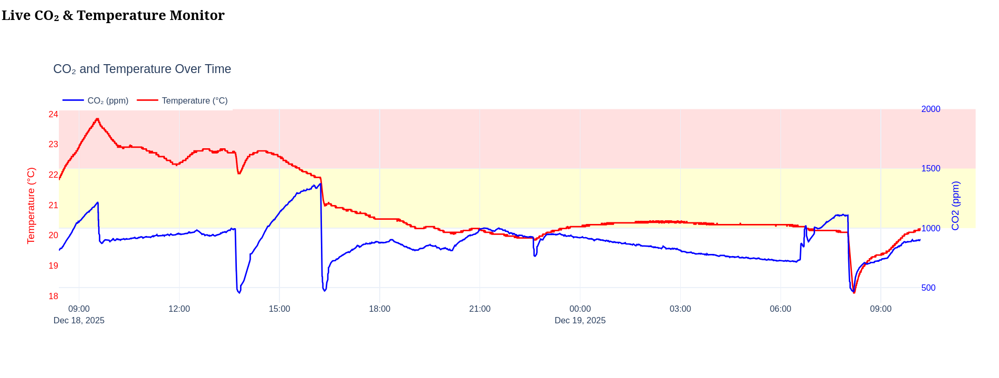

# Lib + CLI to read out ZYG-01 sensors via USB-HID

This repo consists of a `no_std` library for reading out and getting the actual sensor readings from the device, and an
example implementation of a PC CLI program.

Most of the reverse-engineering necessary has already been done by other people, notably
[uucidl/uu.co2-reader](https://github.com/uucidl/uu.co2-reader). Note that for some reason most online resources
regarding this sensor need to decrypt the output of the sensor with some magic table. However, my device just gives out
the data unencrypted. But also, I don't really have an idea how USB HID works so...

My device is a rebrand of [zgm053u](https://www.zyaura.com/product-detail/zgm053u/) namely
[airco2ntrol-mini](https://www.tfa-dostmann.de/produkt/co2-monitor-airco2ntrol-mini-31-5006/) by tfa.
Interestingly the tfa device doesn't even advertise the capability to read out anything from the usb port.

## CLI usage

The CLI works on linux, for other OSes YMMV. It logs approx every 5 seconds the latest co2 and temperature readings to
a csv file in the directory the cli was invoked. If your use doesnt have HID permissions you need to run the cli with
sudo, e.g.:

```bash
cargo build -r --features pc && sudo ./target/release/co2_cli
```

If you want some plots, you can run the `visualize/main.py` file, which will start a python Dash application, e.g.:

```bash
cd visualize/
uv run main.py
```

It will look like this:



## Sensor outputs

The sensor periodically (~0.5-2 times per second) provides some HID reports that contain co2/temp readings or some
other values that few people seem to have figured out so far what they mean. In addition to reading co2 and temp, this
library also tries to find out when the readings are "out of spec". The device shows values up to 3000pm on the
display. Higher values will only show "HI". However, if you only read the co2 values from the sensor (opcode `0x50`),
at some point you will get low values again (mostly 1065), so you don't know that this reading is actually invalid.
I found that packages with opcode `0x6e` decrease somewhat linearly with increasing co2 values. So my bandaid solution
is to watch this value, and when it's lower than some value, the reading will be marked as "invalid" which would
correspond to values being out of range of the original spec (..3000ppm).


